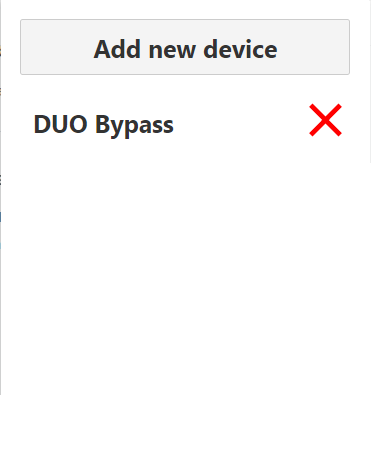
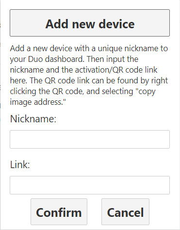

# DUO Bypass Chrome Extension

### WARNING: Using this extension will remove any account security provided by 2FA. If an attacker has access to your computer, they will be able to login to any of your DUO protected accounts!
Based on [script by revalo](https://github.com/revalo/duo-bypass)

---

## Installation
**Google Chrome / Chromium**
1. Download this repo as a [ZIP file from GitHub](https://github.com/lwgw/DUO-Bypass-Chrome/archive/master.zip).
1. Unzip the file and you should have a folder named `DUO-Bypass-Chrome-master`.
1. In Chrome/Edge go to the extensions page (`chrome://extensions` or `edge://extensions`).
1. Enable Developer Mode.
1. Drag the `public` folder anywhere on the page to import it (do not delete the folder afterwards).

## Usage
### Adding a new device
1. Add a new device on your DUO dashboard (choose tablet if you don't want to use a phone number, device operation system does not matter)
1. Create a unique nickname for the new device
1. Open the extension by clicking the extension icon then click the add new device button
1. Input the unique nickname that you chose before
1. Input the link to the QR code OR the activation link
    * QR Code: Right click the QR Code and choose "copy image address"
    * Activation Link: request the link be sent to your email, then copy the link that you recieve
1. Click confirm
### Logging in
1. Enter your username and password
1. When prompted to choose a device to recieve a passcode, click on the extension icon
1. The extension will automatically scan the list of added devices and fill in a passcode

 